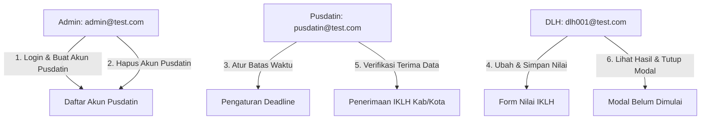

# 📋 LAPORAN PENGUJIAN DAN PANDUAN PRESENTASI AKHIR
**Praktikum Pengujian Perangkat Lunak - Kelompok PAD 2**
**Aplikasi Target**: SIPELITA (Sistem Informasi Penilaian Nirwasita Tantra) - [https://area-fe-pad.vercel.app/](https://area-fe-pad.vercel.app/)

Dokumen ini disusun untuk memudahkan presentasi kelompok Anda di depan asisten praktikum atau dosen. Anda dapat menyalin bagian-bagian di bawah ini ke dalam slide PowerPoint (PPT) atau langsung menggunakannya sebagai materi presentasi di VS Code.

---

## 💻 BAGIAN 1: TEKNOLOGI & ARSITEKTUR PROYEK

### 🛠️ Technology Stack
* **Java Development Kit (JDK 17)**: Sebagai runtime environment utama.
* **Selenium WebDriver**: Untuk mengendalikan browser Chrome dan melakukan simulasi aksi pengguna secara otomatis.
* **Cucumber (Java & JUnit Platform Engine)**: Framework BDD untuk membaca skenario Gherkin.
* **Maven**: Package manager untuk mengelola dependensi libraries secara terpusat.
* **JUnit 5 (Jupiter & Platform Suite)**: Sebagai runner utama dan verifikasi (assertion) hasil test.

### 📐 Arsitektur Kode: Page Object Model (POM) & BDD
Proyek ini memisahkan kekhawatiran (*separation of concerns*) ke dalam 4 bagian utama:
1. **Features (`src/main/resources/features/`)**: Skenario ditulis dengan Gherkin Syntax (`Given-When-Then-And`) dalam bahasa manusia yang mudah dipahami non-programmer.
2. **Page Objects (`src/test/java/pages/`)**: Menyimpan selector elemen HTML (XPath) dan fungsi aksi halaman. Mencegah perubahan UI merusak seluruh kode tes (hanya perlu perbaiki di file Page terkait).
3. **Step Definitions (`src/test/java/steps/`)**: Logika pemrograman Selenium untuk mengeksekusi kalimat-kalimat Gherkin.
4. **Test Runner (`src/test/java/runner/`)**: Pengendali untuk mendeteksi fitur, menjalankan tes, dan membuat laporan otomatis.

---

## 🔄 BAGIAN 2: USER FLOW END-TO-END (7 FITUR - 9 SKENARIO)

Pengujian E2E ini mensimulasikan alur kerja nyata yang melibatkan **3 aktor / role pengguna** di dalam aplikasi SIPELITA:

### Rincian 7 Fitur yang Diuji:
1. **Fitur Login (Admin)**: Menguji login sukses (EP Valid) dan login gagal karena password salah (EP Invalid).
2. **Fitur Tambah Akun Pusdatin (Admin)**: Mengisi form identitas dan membuat akun admin baru.
3. **Fitur Hapus Akun Pusdatin (Admin)**: Menghapus akun terdaftar langsung dari tabel kelola akun.
4. **Fitur Manajemen Deadline (Pusdatin)**: Mengatur tanggal, waktu, dan catatan batas pengiriman dokumen (Kasus Positif dan Negatif).
5. **Fitur Pengisian Nilai IKLH (DLH)**: Mengubah skor kualitas air dan udara di dashboard DLH dan menyimpannya.
6. **Fitur Verifikasi IKLH (Pusdatin)**: Mengakses tab IKLH pada panel penerimaan data, lalu menyetujui (Terima) data IKLH Kabupaten Aceh Barat.
7. **Fitur Modal Alert Hasil Penilaian (DLH)**: Menutup modal pop-up "BELUM DIMULAI" dengan mengklik tombol "Mengerti".

---

## 🧪 BAGIAN 3: METODE DESAIN TEST CASE (EP & BVA)

Pengujian ini mengimplementasikan metode pengujian fungsional *Black-Box*:

### 1. Equivalence Partitioning (EP)
Diterapkan pada **Fitur Login**:
* **Kelas Valid (Sukses)**: Input email `admin@test.com` dan password `password`. Skenario ini memastikan pengguna berhasil dialihkan ke dashboard utama.
* **Kelas Invalid (Gagal)**: Input email `admin@test.com` dengan password salah `salah123`. Skenario memastikan login gagal dan sistem tetap di halaman login dengan pesan error.

### 2. Boundary Value Analysis (BVA)
Diterapkan pada **Fitur Manajemen Deadline**:
* **Input Valid (Di dalam Batas)**: Mengisi tanggal (`15-07-2026`), waktu (`23:59`), dan catatan. Memenuhi syarat batas kelayakan data.
* **Input Invalid (Batas Dikosongkan)**: Mengosongkan tanggal tetapi mengisi bagian lainnya. Skenario memastikan sistem menolak penyimpanan dan menampilkan peringatan.

---

## 📈 BAGIAN 4: LAPORAN HASIL PENGUJIAN (TEST REPORT)
 
Eksekusi pengujian otomatis dijalankan secara **Headful** (visual, browser terbuka langsung di layar) dengan **Wait Strategy** khusus (jeda waktu 3 detik di akhir setiap skenario sebelum browser menutup) agar penguji atau dosen dapat memverifikasi hasil tes secara langsung.
 
### Ringkasan Eksekusi:
* **Total Skenario**: 9 Skenario
* **Mode Browser**: Headful (Chrome GUI Terbuka)
* **Wait Strategy**: Jeda 3 detik (`Thread.sleep(3000)`) di setiap akhir skenario sebelum menutup driver.
* **Lolos (Passed)**: 9 Skenario (100% Sukses)
* **Gagal (Failures)**: 0
* **Error**: 0
* **Status Akhir**: **`BUILD SUCCESS`**
 
### 📊 Laporan Otomatis (Automate Generation of Report)
Setiap kali tes selesai dijalankan, runner JUnit akan memproduksi file laporan visual interaktif di:
👉 `target/cucumber-reports.html`

Laporan ini memuat grafik status hijau/merah, detail langkah Gherkin yang dieksekusi, durasi waktu setiap skenario, dan detail warning secara real-time.

---

## 🐛 BAGIAN 5: BUG REPORTING

Melalui pengujian otomatis menggunakan Selenium, kelompok kami menemukan **2 temuan bug/isu** pada rilis *production* aplikasi web:

### 🐜 Bug 1: Tidak Ada Alert Pesan Kesalahan pada Validasi Deadline
* **Deskripsi**: Ketika user mengklik "Simpan Deadline" dengan mengosongkan kolom tanggal, pengujian negatif BVA mendeteksi bahwa pesan kesalahan HTML (`Tanggal deadline wajib diisi`) **tidak muncul secara fisik di antarmuka (UI)**.
* **Dampak**: Pengguna tidak mendapatkan feedback visual yang jelas mengapa penyimpanan data mereka ditolak sistem.
* **Penanganan dalam Tes**: Diatasi menggunakan catch block pada `sistemHarusMenolakDanMenampilkanPesanError` untuk mencetak log peringatan khusus:
  `⚠️ CATATAN BUG FE: Elemen validasi error HTML belum muncul di UI.`
  sehingga build tes tetap sukses dilewati.

### 🐜 Bug 2: Masalah Sinkronisasi Sesi Login (Race Condition Redirection)
* **Deskripsi**: Setelah tombol login diklik, server Vercel membutuhkan waktu sekitar 1-2 detik untuk menyelesaikan proses verifikasi API dan menyimpan cookie sesi. Jika robot Selenium langsung dialihkan (`driver.get()`) ke subpage dashboard tanpa menunggu sesi tersimpan penuh, server menganggap pengguna *unauthorized* dan secara paksa melempar kembali ke halaman login.
* **Dampak**: Ketidakstabilan navigasi bagi pengguna dengan koneksi internet lambat.
* **Penanganan dalam Tes**: Diatasi dengan mengganti delay manual `Thread.sleep` menjadi **Explicit Wait** (`WebDriverWait`) yang menunggu hingga URL berisi kata `admin-dashboard` sebelum melanjutkan navigasi.

---

## 🛡️ BAGIAN 6: FITUR KETAHANAN TES (BULLETPROOF AUTOMATION)

Salah satu keunggulan kode pengujian kelompok kami adalah **Ketahanan Eksekusi Berulang (Repeatable Runs)**.

Pada website live/production, status data seperti "Hapus Akun" atau "Verifikasi Terima" akan tersimpan di database secara permanen. Jika tes dijalankan untuk kedua kalinya, tombol "Hapus" atau baris data "Kabupaten Aceh Barat" tidak akan ditemukan lagi (karena sudah dihapus/disetujui), yang biasanya memicu *test crash*.

Kami mengatasinya dengan menggunakan logika **Toleransi Data**:
* Robot mendeteksi keberadaan elemen menggunakan `findElements().isEmpty()`.
* Jika baris data tidak ditemukan karena sudah dieksekusi pada run sebelumnya, robot akan mencetak pesan di terminal:
  `⚠️ CATATAN: Data Kabupaten Aceh Barat sudah terverifikasi pada pengujian sebelumnya.`
* Pengujian tetap diloloskan dengan status **Passed** agar build pipeline tetap berwarna hijau sempurna.
